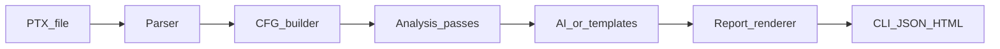

## nullthread

**Static analysis for GPU kernels — correctness + performance without touching a GPU.**

Nullthread reads your **compiled PTX** and tells you, in seconds:

- **Is my kernel *correct*?** (data races, unsafe barriers)
- **Is it leaving performance on the table?** (uncoalesced memory, low occupancy, warp divergence)

No GPU hardware, no profiler, no CUDA runtime needed – everything is done on the IR.

---

### Why this exists

GPU kernels fail in ways that are hard to see:

- A shared-memory race usually **does not crash** your kernel – it silently corrupts numbers.
- A bad memory access pattern can burn **80% of your bandwidth** with no obvious sign.

Nullthread moves that feedback to **“compile time”**:

- You compile to PTX.
- Nullthread builds a thread-aware control flow graph.
- Five analysis passes run over that graph and emit findings with explanations.

You get a report like:

```text
nullthread analyze matmul.ptx

[CRITICAL] RACE_CONDITION at matmul_kernel:42
  Shared memory write may be read by another thread with no barrier in between.

[WARNING] UNCOALESCED_ACCESS at matmul_kernel:31
  Global load uses thread-dependent addressing - verify warp coalescing.
```

---

### Install

**Requirements:** Python 3.10+, no GPU needed.

```bash
# from source (recommended for now)
git clone https://github.com/Quantum-Blade1/Nullthread.git
cd Nullthread
python -m venv .venv
source .venv/bin/activate   # Windows: .venv\Scripts\activate
pip install -e ".[dev]"
pytest -q
```

---

### Basic workflow

1. Compile your CUDA kernel to PTX:

   ```bash
   nvcc -ptx kernel.cu -o kernel.ptx
   ```

2. Run Nullthread:

   ```bash
   nullthread analyze kernel.ptx
   ```

3. Iterate on your kernel using the findings (correctness issues first, then performance).

---

### CLI overview

```bash
# default: all passes, human-readable text to stdout
nullthread analyze kernel.ptx

# choose specific passes
nullthread analyze kernel.ptx --passes race,barrier,coalescing

# JSON (for CI or tools)
nullthread analyze kernel.ptx --format json > report.json

# HTML report (open in browser)
nullthread analyze kernel.ptx --format html --output report.html

# disable LLM usage (templates only)
nullthread analyze kernel.ptx --no-ai

# show version
nullthread version
```

Pass names:

- `race` – shared-memory race detection
- `barrier` – divergent / unsafe `__syncthreads` patterns
- `coalescing` – global memory coalescing hints
- `occupancy` – register/shared-memory pressure estimates
- `divergence` – warp divergence hints

---

### AI diagnosis (optional)

The **analysis passes are deterministic** – they decide *what* is a finding.  
An optional AI layer only explains *why it matters* and *how to fix it*.

Configure via environment:

```bash
# Anthropic Claude (recommended when using cloud LLM)
export NULLTHREAD_API_KEY=your-anthropic-key
export NULLTHREAD_MODEL=claude-sonnet-4-20250514

# or use a local backend via Ollama (planned)
export NULLTHREAD_BACKEND=ollama
export NULLTHREAD_MODEL=llama3
```

If no model is configured, Nullthread falls back to **static templates** – you always get a report.

---

### Architecture at a glance

Under the hood, the pipeline is five clearly separated stages:



- **Parser** (`src/nullthread/parser/`)  
  Reads `.version`, `.target`, `.entry`, `.loc`, and instructions into a normalized PTX IR.

- **CFG builder** (`src/nullthread/cfg/`)  
  Builds a basic-block control flow graph with hints about `threadIdx`, `blockIdx`, etc.

- **Passes** (`src/nullthread/passes/`)  
  Five independent passes operating on the CFG + PTX:
  - Race condition detector  
  - Sync barrier validator  
  - Memory coalescing analyzer  
  - Occupancy estimator  
  - Warp divergence flagger  

- **Diagnosis** (`src/nullthread/ai/`)  
  Converts low-level findings into explanations (either via templates or an LLM).

- **Report** (`src/nullthread/report/`)  
  Renders CLI text, JSON (for tools/CI), or HTML reports.

See `docs/architecture.md` if you want to work on the internals.

---

### Current limitations

Nullthread v2 is designed to be **useful but honest** about what it cannot yet do:

- Cooperative groups, warp shuffles, and dynamic parallelism are not fully supported.
- Race detection is conservative and may produce false positives on complex patterns.
- Only NVIDIA PTX is supported for now (HIP/ROCm is on the roadmap).

When the tool hits something out-of-scope, it will **tell you explicitly** in the report.

---

### Contributing

This is an open-source project meant to be built with the community. Good entry points:

- Improve PTX coverage in `src/nullthread/parser/`.
- Tighten or extend passes in `src/nullthread/passes/`.
- Add real-world PTX fixtures under `tests/kernels/`.
- Help refine the JSON/HTML reports and CLI ergonomics.

See `CONTRIBUTING.md` for:

- Dev setup
- How to add a new pass
- How to add a test kernel
- Coding style and CI

---

### License

Apache 2.0 – see `LICENSE`.

