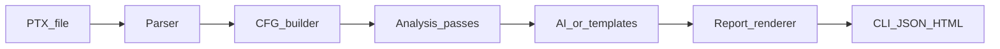

# Nullthread architecture (v2)

Nullthread analyzes **PTX** (NVIDIA GPU intermediate representation) without hardware. The pipeline is intentionally staged with typed boundaries so contributors can work in parallel.

## Pipeline

1. **Input**: `.ptx` from `nvcc -ptx` (or compatible toolchain output).
2. **Parser** (`nullthread.parser`): tokenizes lines, tracks `.loc` source lines, identifies `.entry` kernels, classifies opcodes (shared/global/barrier/branch).
3. **CFG** (`nullthread.cfg`): splits instructions into basic blocks (heuristic), tracks thread-index hints for divergence-related reasoning.
4. **Passes** (`nullthread.passes`): independent checks producing deterministic `Finding` objects:
   - `race` — shared writes vs reads without `bar.sync` / barrier
   - `barrier` — predicated / divergent barrier patterns (heuristic)
   - `coalescing` — global loads with thread-dependent or strided addressing
   - `occupancy` — register / shared memory pressure from declarations
   - `divergence` — control flow depending on lane/thread id (heuristic)
5. **Diagnosis** (`nullthread.ai`): enriches findings with templates or optional Anthropic API (strict JSON). Disk cache keyed by finding hash.
6. **Report** (`nullthread.report`): `cli`, `json`, `html` renderers.

## Key types

- `Instruction`, `ParsedPTX` — flat IR with kernel association and `.loc` mapping.
- `ControlFlowGraph`, `BasicBlock` — per-kernel graph (extensible).
- `Finding` — deterministic machine-readable issue; `DiagnosedFinding` adds narrative fields.

## Extension points

- Add a new pass: implement `run(...)` like existing passes, register in `passes/registry.py`.
- Add AI backend: implement a function similar to `ai/anthropic_backend.py` and branch in `ai/diagnose.py`.
- Improve PTX coverage: extend `parser/ptx.py` opcode/operand models first, then tighten passes.

## Limitations

Heuristic passes may false-positive (especially races). Cooperative groups, warp shuffles, and dynamic parallelism require explicit parser and pass support.
